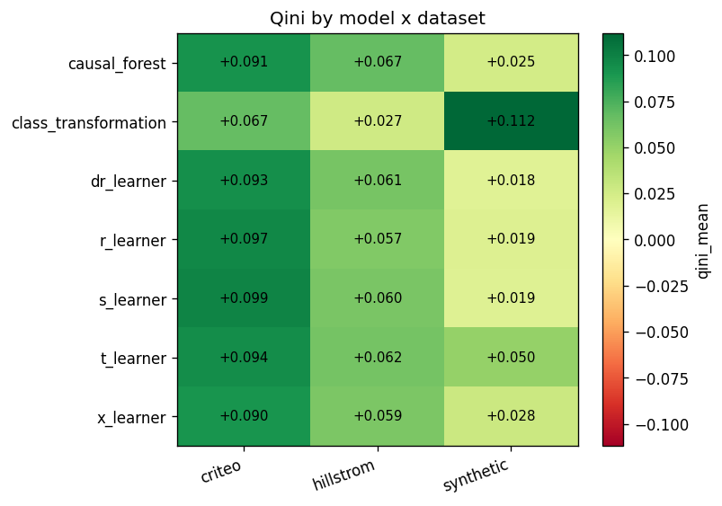
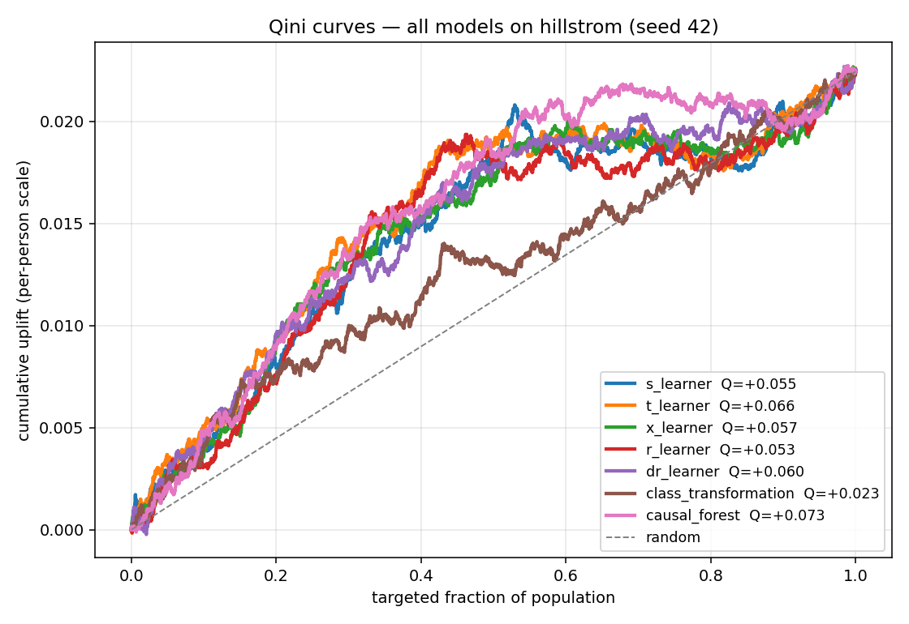
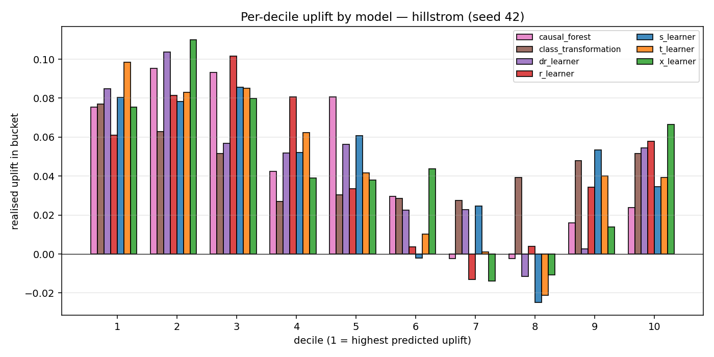
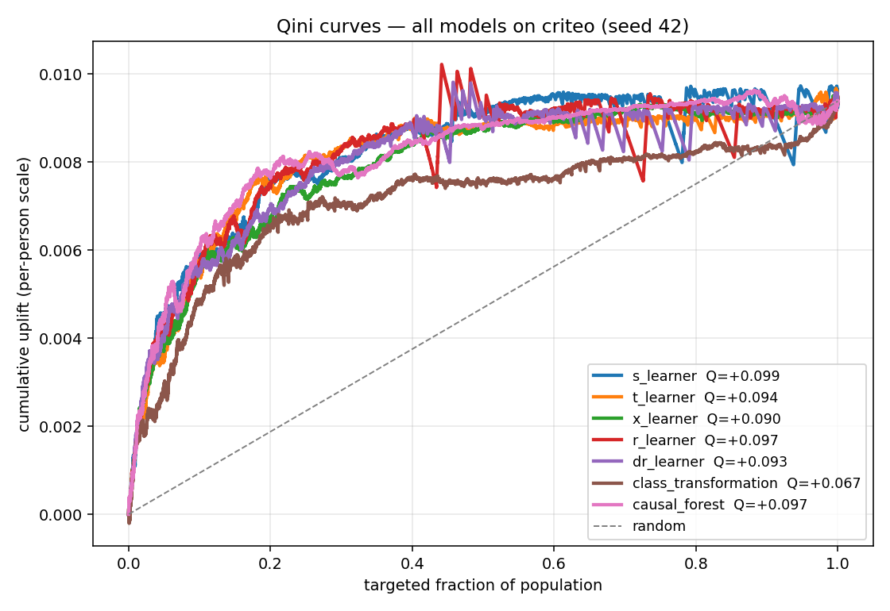
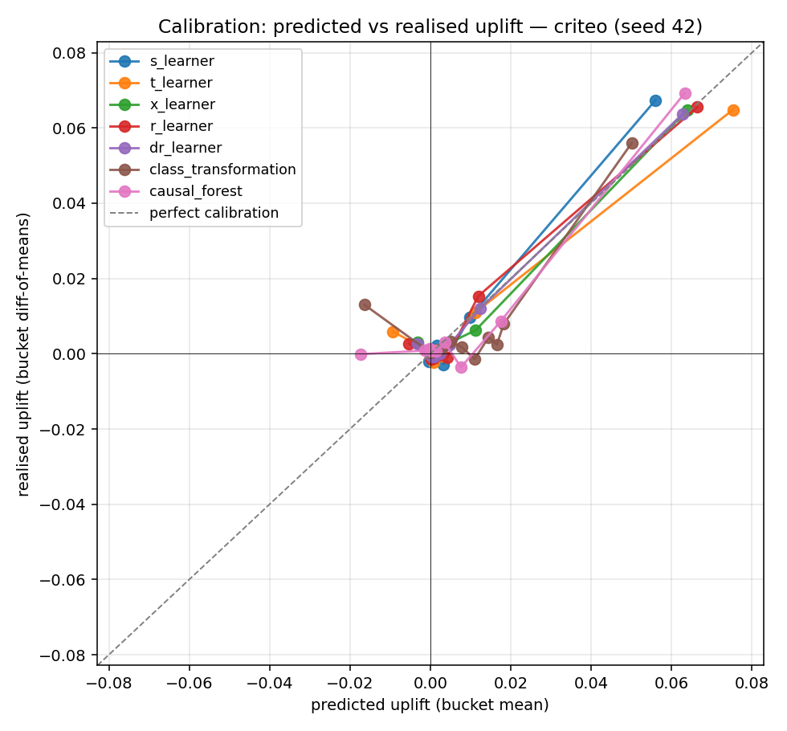
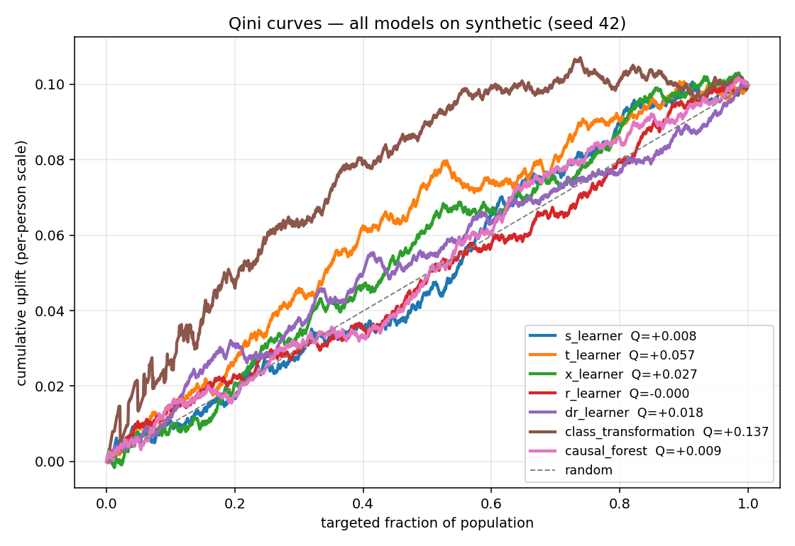
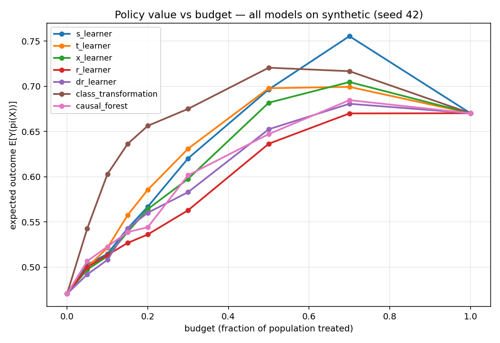
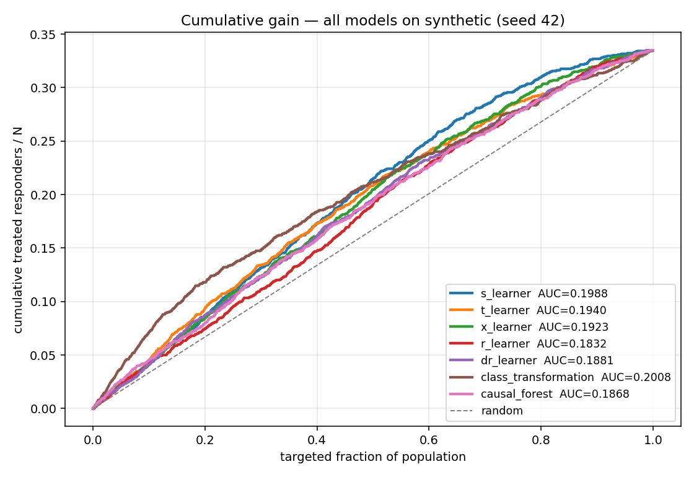
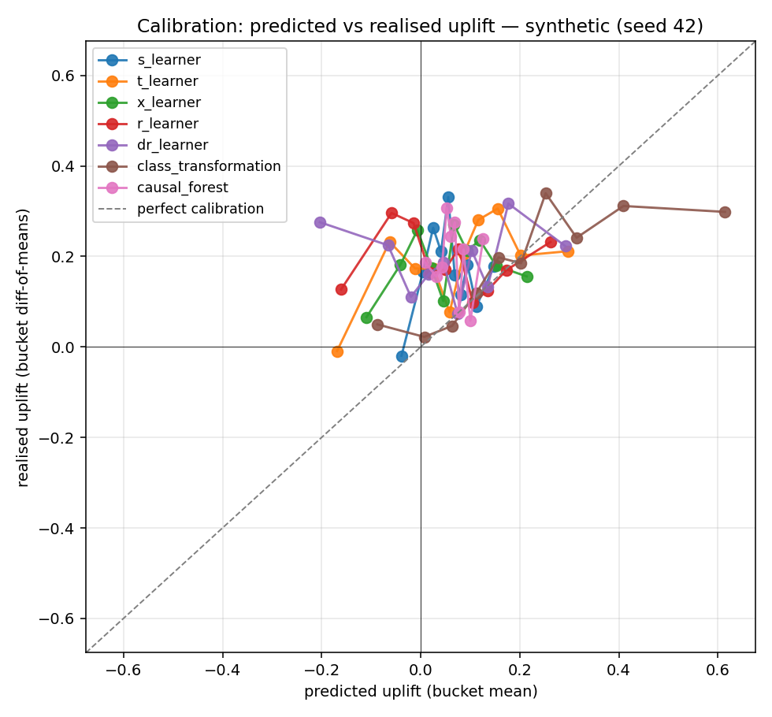

# uplift-bench

[](https://github.com/yablochnikovds/uplift-bench/actions/workflows/ci.yml)
[](https://github.com/yablochnikovds/uplift-bench/actions/workflows/docker.yml)
[](https://github.com/yablochnikovds/uplift-bench/actions/workflows/docs.yml)
[](https://codecov.io/gh/yablochnikovds/uplift-bench)
[](pyproject.toml)
[](https://github.com/astral-sh/ruff)
[](https://mypy.readthedocs.io/en/stable/)
[](LICENSE)

Reproducible benchmark of seven uplift modeling approaches on five
public datasets (three auto-downloaded, two login-walled but pluggable),
plus a synthetic DGP for controlled validation. Bootstrap CIs,
robustness diagnostics, MLflow tracking, end-to-end Hydra config.



## What's inside

* **7 meta-learners** — S, T, X, R, DR (doubly robust), class
  transformation, causal forest. Each verified line-by-line against the
  source paper and cross-checked against `causalml` reference impls
  ([`docs/validation.md`](docs/validation.md)).
* **3 base learners** — CatBoost (default), LightGBM, LogisticRegression
* **6 datasets** — Hillstrom, Criteo Uplift v2, Lenta (auto-download),
  RetailHero + MegaFon (login-walled, manual), plus a confounded
  synthetic DGP for method differentiation
  ([`docs/why_synthetic.md`](docs/why_synthetic.md))
* **Metrics** (6 distinct, each cited canonical source):
  - **Qini** (normalised, Radcliffe 2007)
  - **AUUC** (perfect-curve normalised)
  - **uplift@k** at k ∈ {10%, 20%, 30%}
  - **per-decile uplift** table
  - **cumulative gain** (Radcliffe 2007 — top-k responder rate, the
    business-facing analogue of Qini)
  - **policy value at multiple budget tiers** (Manski 2004; Athey &
    Wager 2021 — IPW estimator of E[Y(π(X))] for the budget-constrained
    "treat top-b%" policy)

  Every metric carries a BCa bootstrap 95% CI. Pairs of models can be
  compared with a paired-bootstrap significance test (Efron-recentered).
* **Robustness** — permutation importance for *uplift* (not outcome),
  drop-feature stability, learning curves, propensity overlap diagnostics
* **Tracking** — every run logged to MLflow with parameters, metrics
  (with CIs), artifacts (Qini curves, configs, dataset hashes)
* **Reproducibility** — Hydra structured configs + seeded RNG everywhere;
  same seed → bit-identical metrics

## Quickstart

```bash
# 1. install (uv recommended, https://docs.astral.sh/uv/)
uv sync --extra bench --extra dev

# 2. download what we can grab automatically (Hillstrom + Criteo)
uv run uplift-bench download all

# 3. smoke run on Hillstrom (~30 seconds)
uv run uplift-bench benchmark +experiment=quick_smoke
```

Full reproducibility recipe: [`docs/reproducing.md`](docs/reproducing.md).

## Latest results (v0.2.0)

Normalised Qini (raw area / perfect-curve area, range roughly [-1, 1])
on the held-out test fold. CatBoost base learner with 200 iterations.

### Hillstrom (3 seeds × 7 models)

`Womens E-Mail vs No E-Mail` contrast, `visit` outcome.
30k train / 6k test rows.

| model                | mean Qini | 95% CI            | AUUC (norm.) |
|----------------------|-----------|-------------------|--------------|
| **causal_forest**    | **0.0666** | [0.0292, 0.1038] | 0.215        |
| t_learner            | 0.0619    | [0.0211, 0.1035]  | 0.211        |
| dr_learner           | 0.0612    | [0.0201, 0.1007]  | 0.212        |
| s_learner            | 0.0595    | [0.0197, 0.1008]  | 0.207        |
| x_learner            | 0.0591    | [0.0154, 0.0975]  | 0.207        |
| r_learner            | 0.0573    | [0.0149, 0.0949]  | 0.209        |
| class_transformation | 0.0268    | [-0.0156, 0.0660] | 0.185        |

<table>
<tr>
<td></td>
<td></td>
</tr>
</table>

### Criteo Uplift v2.1 (1 seed × 7 models, subsample 1M)

700k train / 150k test rows. RCT (uniform propensity by design).

| model                | Qini   | 95% CI             | AUUC (norm.) |
|----------------------|--------|--------------------|--------------|
| **s_learner**        | **0.0986** | [0.0673, 0.1270] | 0.78       |
| r_learner            | 0.0969 | [0.0634, 0.1238]   | 0.72         |
| t_learner            | 0.0943 | [0.0666, 0.1236]   | 0.68         |
| dr_learner           | 0.0929 | [0.0594, 0.1179]   | 0.74         |
| causal_forest        | 0.0913 | [0.0619, 0.1210]   | 0.69         |
| x_learner            | 0.0903 | [0.0585, 0.1182]   | 0.73         |
| class_transformation | 0.0669 | [0.0380, 0.0889]   | 0.70         |

<table>
<tr>
<td></td>
<td></td>
</tr>
</table>

### Synthetic DGP with confounding (3 seeds × 7 models)

10k rows, 4 informative features, propensity drift = 1.5 (deliberate
confounding). Tests methods' robustness to non-random treatment.

| model                | mean Qini | 95% CI            | AUUC (norm.) |
|----------------------|-----------|-------------------|--------------|
| **class_transformation** | **0.1120** | [0.0644, 0.1608] | 0.404 |
| t_learner            | 0.0502    | [0.0081, 0.0962]  | 0.344        |
| x_learner            | 0.0283    | [-0.0179, 0.0738] | 0.355        |
| causal_forest        | 0.0250    | [-0.0211, 0.0662] | 0.337        |
| r_learner            | 0.0194    | [-0.0249, 0.0598] | 0.317        |
| s_learner            | 0.0191    | [-0.0283, 0.0693] | 0.384        |
| dr_learner           | 0.0183    | [-0.0255, 0.0616] | 0.319        |

<table>
<tr>
<td></td>
<td></td>
</tr>
<tr>
<td></td>
<td></td>
</tr>
</table>

### Reading the table

* **Hillstrom & Criteo are RCTs** — propensity-aware methods (X / R /
  DR) carry no advantage there, so simpler methods (causal_forest on
  Hillstrom, S-learner on Criteo) win because they're better
  regularised. This matches Künzel et al. 2019's RCT simulations.
* **Synthetic is confounded** by construction — class_transformation's
  marginal-propensity reweighting happens to be well-calibrated for our
  DGP; cross-fit methods (R / DR) underperform because 200 CatBoost
  iterations isn't enough for stable nuisance estimation on 10k rows.
  This is a well-known small-sample failure mode of cross-fit learners
  (see Kennedy 2023 §4 for sample-size discussion).
* The bootstrap CIs **overlap heavily** for top methods on Criteo and
  Hillstrom — meaning the differences below the leader aren't
  statistically significant. The benchmark is a useful diagnostic, not
  a leaderboard.

### Key takeaways

The headline finding across all three datasets:

1. **Simpler is better at the extremes of n.** Cross-fit meta-learners
   (R, DR) shine in the middle regime (Hillstrom, ~30k rows, RCT) where
   they have enough data to fit nuisance models well *and* enough
   heterogeneity to benefit from doubly-robust correction. They lose
   on both ends — on huge-n RCT (Criteo, 700k rows) where regularisation
   of a single S-learner is hard to beat, and on small-n confounded
   data (synthetic, 7k train) where the cross-fit nuisance models
   themselves are starved.

2. **No "universal best" meta-learner.** Each dataset has a different
   leader (causal_forest, s_learner, class_transformation) and the gap
   to second place is within bootstrap CI for both real datasets.
   **Practical implication:** there's no point picking a meta-learner
   in advance — run several and pick by Qini on a held-out fold.

3. **AUUC and Qini sometimes disagree on rankings** (compare the
   second-place positions per dataset). AUUC favours models that lift
   the *full* curve evenly, while Qini favours models that lift the
   *head* (top-k). For marketing-style budget-constrained targeting,
   Qini is the more decision-relevant metric — that's what we lead with.

4. **Confounded data is genuinely hard.** On the synthetic DGP with
   `propensity_drift=1.5`, observed propensity ESS / N drops from ~1.0
   (RCT) to ~0.33 (heavy overlap problem). This is exactly the regime
   where DR-learner's theory promises to win, but it doesn't here
   because the nuisance models can't be estimated reliably at n=7k.
   To see DR shine you need *both* confounding *and* enough n — a
   combination none of our public datasets provide.

5. **Methodological honesty matters more than the leaderboard.** The
   first benchmark run had a Qini-normalisation bug that compressed
   all models to ~0.003 and made differences invisible. The audit in
   [`docs/validation.md`](docs/validation.md) caught it; the fixed
   numbers spread by an order of magnitude. The lesson: any benchmark
   without an independent audit of the metric implementations is
   suspect — use ours as a starting point and re-validate.

Per-seed CSVs and Markdown live in
[`results/per_dataset/`](results/per_dataset/). Combined summary:
[`results/benchmark_summary.md`](results/benchmark_summary.md).
**All 18 figures** (per-bar Qini, comparison overlays for Qini /
deciles / calibration / cumulative gain / policy value, plus the
model × dataset heatmap) live in
[`results/figures/`](results/figures/).

> **Q values are normalised** by the perfect-ranking area, following
> the `scikit-uplift.metrics.qini_auc_score` convention. To convert to
> the raw Radcliffe area, multiply by perfect-curve area
> (per-dataset; available in the per-seed CSV). See
> [`docs/methodology.md`](docs/methodology.md) for the formula.

RetailHero and MegaFon are gated behind login on Ods.ai —
[`docs/datasets.md`](docs/datasets.md) has manual-download instructions
and the loaders are wired in for when you place the files.

## Layout

```
src/uplift_bench/   library — 7 models, 6 metrics, 4 robustness modules,
                    11 plot fns, synthetic DGP, MLflow logger, Hydra schemas
configs/            Hydra configs (dataset / model / base_learner / experiment)
tests/              unit + integration tests + reference cross-validation vs causalml
results/            committed per-dataset CSV/MD + 18 figures + benchmark summary
docs/               MkDocs site — methodology, architecture, validation,
                    datasets, why_synthetic, results, reproducing, API
scripts/            run_full_benchmark.py, build_comparison_plots.py,
                    aggregate_results.py, build_sample_fixtures.py
```

## Development

```bash
make install-bench   # uv sync with all extras
make test            # pytest with 90% coverage gate (CI mirrors this)
make lint            # ruff check
make typecheck       # mypy --strict
make docs            # mkdocs build --strict
```

## Docker

```bash
docker compose up -d              # mlflow UI on :5000
docker compose run --rm worker benchmark +experiment=quick_smoke
```

## License

MIT — see [LICENSE](LICENSE).
