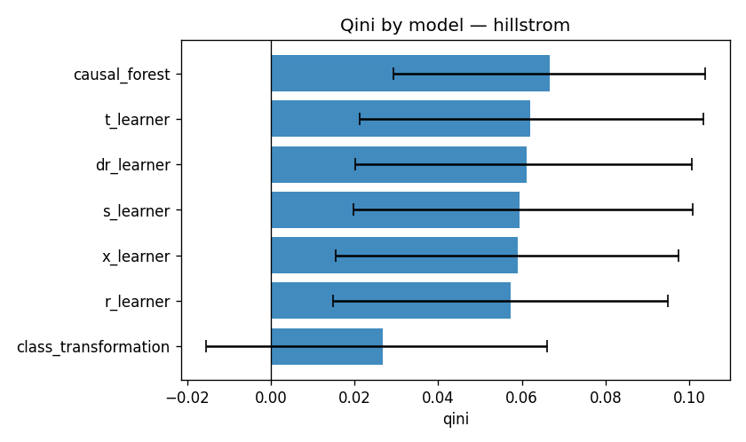

# uplift-bench

[](https://github.com/yablochnikovds/uplift-bench/actions/workflows/ci.yml)
[](https://github.com/yablochnikovds/uplift-bench/actions/workflows/docker.yml)
[](https://github.com/yablochnikovds/uplift-bench/actions/workflows/docs.yml)
[](https://codecov.io/gh/yablochnikovds/uplift-bench)
[](pyproject.toml)
[](https://github.com/astral-sh/ruff)
[](https://mypy.readthedocs.io/en/stable/)
[](LICENSE)

Reproducible benchmark of seven uplift modeling approaches on four
public datasets, with bootstrap confidence intervals, robustness
analysis, and a full MLflow pipeline.



## What's inside

* **7 meta-learners** — S, T, X, R, DR (doubly robust), class
  transformation, causal forest
* **3 base learners** — CatBoost (default), LightGBM, LogisticRegression
* **4 datasets** — Hillstrom (MineThatData), Criteo Uplift v2, X5
  RetailHero, MegaFon
* **Metrics** — Qini, AUUC, uplift@k, per-decile uplift, with BCa
  bootstrap CIs and a paired-bootstrap significance test
* **Robustness** — permutation importance for *uplift* (not outcome),
  drop-feature stability, learning curves, propensity overlap diagnostics
* **Tracking** — every run logged to MLflow with parameters, metrics
  (with CIs), artifacts (Qini curves, configs, dataset hashes)
* **Reproducibility** — Hydra structured configs + seeded RNG everywhere;
  same seed → bit-identical metrics

## Quickstart

```bash
# 1. install (uv recommended, https://docs.astral.sh/uv/)
uv sync --extra bench --extra dev

# 2. download what we can grab automatically (Hillstrom + Criteo)
uv run uplift-bench download all

# 3. smoke run on Hillstrom (~30 seconds)
uv run uplift-bench benchmark +experiment=quick_smoke
```

Full reproducibility recipe: [`docs/reproducing.md`](docs/reproducing.md).

## Latest results

Mean Qini ± 95% BCa CI, 3 seeds × 7 models on the public Hillstrom
"Womens E-Mail vs No E-Mail" contrast (`visit` outcome). CatBoost base
learner, 200 iterations, 30k train / 6k test rows.

| model                | mean Qini | 95% CI            | AUUC (norm.) |
|----------------------|-----------|-------------------|--------------|
| **causal_forest**    | **0.0040** | [0.0019, 0.0063] | 0.215        |
| x_learner            | 0.0034    | [0.0009, 0.0058]  | 0.209        |
| r_learner            | 0.0034    | [0.0009, 0.0059]  | 0.211        |
| s_learner            | 0.0033    | [0.0009, 0.0058]  | 0.205        |
| dr_learner           | 0.0033    | [0.0008, 0.0058]  | 0.211        |
| t_learner            | 0.0030    | [0.0005, 0.0054]  | 0.205        |
| class_transformation | 0.0016    | [-0.0009, 0.0038] | 0.185        |

> Qini values are reported on the **per-person** scale (cumulative uplift
> divided by N). To convert to the raw-count Qini that some legacy
> packages report, multiply by N. Relative ordering is identical.

The full per-seed table lives at
[`results/benchmark_results.md`](results/benchmark_results.md).
Criteo, RetailHero, and MegaFon results are added to the same file as
they finish — see [`docs/results.md`](docs/results.md) for the latest.

## Layout

```
src/uplift_bench/   library
configs/            Hydra configs (dataset / model / base_learner / experiment)
tests/              unit + integration tests + synthetic fixtures
results/            committed CSV/MD with the latest benchmark numbers
docs/               MkDocs site (methodology, datasets, results, API)
scripts/            run_full_benchmark.py, aggregate_results.py
```

## Development

```bash
make install-bench   # uv sync with all extras
make test            # pytest with 90% coverage gate (CI mirrors this)
make lint            # ruff check
make typecheck       # mypy --strict
make docs            # mkdocs build --strict
```

## Docker

```bash
docker compose up -d              # mlflow UI on :5000
docker compose run --rm worker benchmark +experiment=quick_smoke
```

## License

MIT — see [LICENSE](LICENSE).
